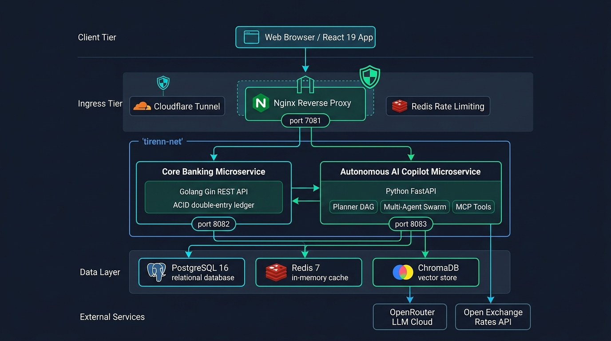
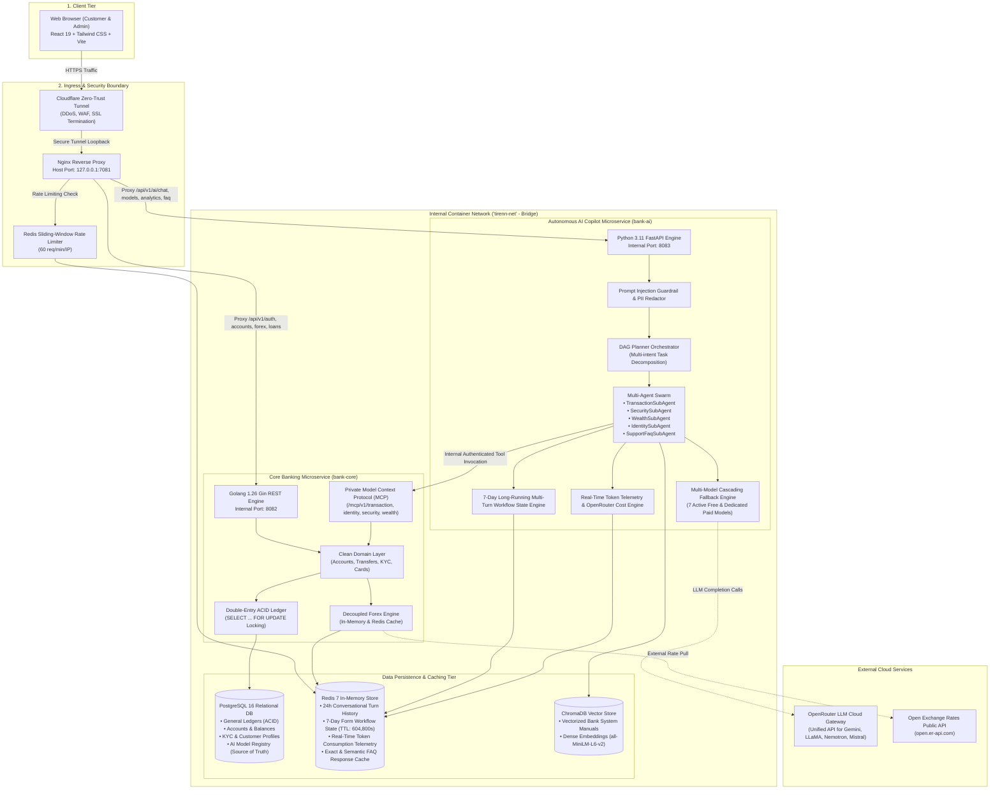
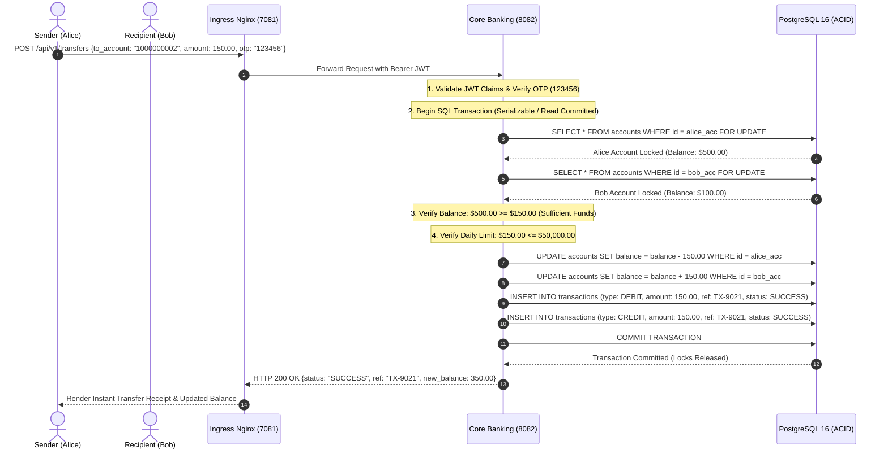
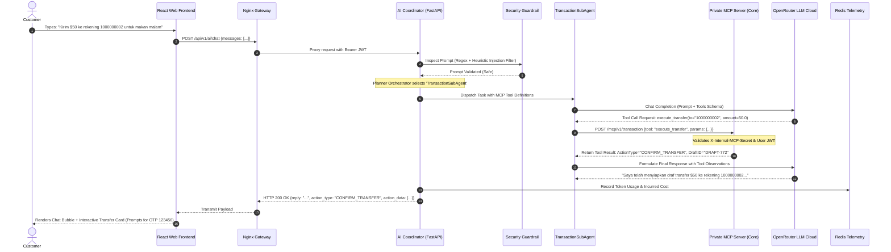
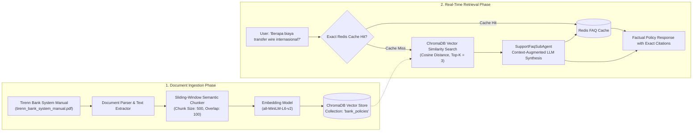
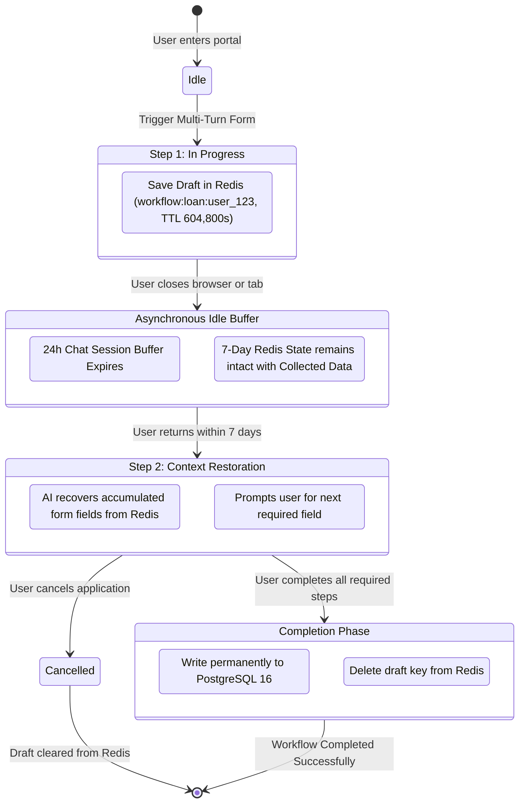
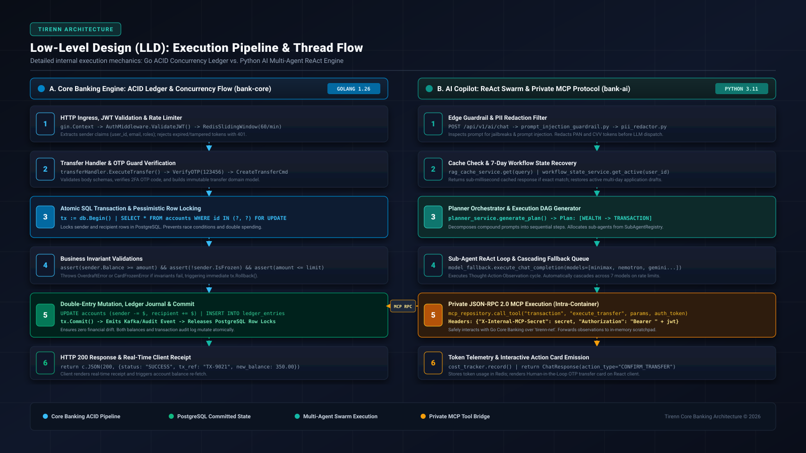

# Tirenn Autonomous Neo-Bank: System Architecture, High-Level Design (HLD) & Low-Level Design (LLD)

This document provides the definitive, comprehensive architectural blueprint for the **Tirenn Autonomous Neo-Banking Platform**, detailing the distributed microservices topology, High-Level Design (HLD) workflows, Low-Level Design (LLD) execution pipelines, database concurrency models, and network isolation boundaries.

---

## 1. High-Level Architecture Overview (HLD)

Tirenn Bank is engineered as a zero-trust, event-driven, distributed neo-banking ecosystem designed for high-concurrency financial throughput, absolute ACID data integrity, and autonomous agentic AI operations.



### 1.1 Architectural Blueprint & Topology



---

## 2. Architectural Tiers & Component Responsibilities

### 2.1 Ingress & Security Isolation Tier
* **Zero-Trust Host Exposure**: Only the `bank-frontend` (Nginx) container binds to the host loopback interface (`127.0.0.1:7081`). 
* **Complete Backend Port Cloaking**: `bank-core` (port 8082) and `bank-ai` (port 8083) have **zero exposed host ports**. They communicate strictly over the internal isolated bridge network (`tirenn-net`).
* **Cloudflare Zero-Trust Integration**: Public access is channeled via Cloudflare Tunnel directly to `127.0.0.1:7081`, inheriting Cloudflare DDoS mitigation, Web Application Firewall (WAF), and automatic SSL/TLS termination.
* **Nginx Gateway Proxy**: Acts as the single entrypoint, serving production React SPA assets and reverse-proxying API calls:
  * `/api/v1/auth`, `/api/v1/accounts`, `/api/v1/transfers`, `/api/v1/forex`, `/api/v1/loans` $\rightarrow$ `http://bank-core:8082`
  * `/api/v1/ai/*` $\rightarrow$ `http://bank-ai:8083`

---

### 2.2 Core Banking Microservice (`bank-core` - Golang 1.26)
Built according to **Clean Domain Architecture** and **SOLID principles**:
* **ACID Financial Ledger Engine**: Enforces strict double-entry bookkeeping. Every fund movement creates balanced debit and credit entries.
* **Concurrency & Race Condition Defense**: Uses PostgreSQL pessimistic row-level locking (`SELECT ... FOR UPDATE`) within isolated database transactions to prevent double-spending, negative balances, and race conditions during simultaneous transfers.
* **Decoupled Forex Engine**: Provides cached multi-currency conversion (USD, EUR, GBP, JPY, SGD, AUD, CAD, IDR) with configurable bank spread margin fees (0.5% - 1.2%).
* **Private Model Context Protocol (MCP) Servers**:
  * Implements JSON-RPC 2.0 endpoints (`/mcp/v1/transaction`, `/mcp/v1/identity`, `/mcp/v1/security`, `/mcp/v1/wealth`).
  * Protected by dual-layer authorization: requires both the customer's Bearer JWT and the internal service secret (`X-Internal-MCP-Secret`).

---

### 2.3 Autonomous AI Microservice (`bank-ai` - Python 3.11)
Operates as an intelligent multi-agent banking copilot with direct tool calling and RAG capabilities:
* **Edge Security Guardrail**: Inspects all incoming customer prompts for prompt injection, jailbreak attempts, and system prompt extraction before dispatching to LLMs.
* **Planner Orchestrator (DAG Engine)**: Evaluates user intent and decomposes compound queries into ordered Directed Acyclic Graphs (e.g., *Check live conversion of 500 USD to EUR $\rightarrow$ prepare transfer of that amount to Sarah*).
* **Multi-Agent Swarm (`SubAgentRegistry`)**:
  * **`TransactionSubAgent`**: Manages real-time balance checks, transaction history streaming, and smart P2P transfer drafting.
  * **`SecuritySubAgent`**: Executes instant debit card freezing/unfreezing and custom daily spending limit slider updates.
  * **`WealthSubAgent`**: Performs real-time forex conversions, loan amortization simulations, and beneficiary management.
  * **`IdentitySubAgent`**: Retrieves customer verification levels and KYC Tier status.
  * **`SupportFaqSubAgent`**: Queries the ChromaDB vector knowledge base to provide factual, citation-backed answers regarding bank policies, fees, and rules.
* **Dual-Mode LLM Routing & Multi-Tier Fallback Pool**:
  * **Free Tier Mode**: Dynamically fetches active free models from PostgreSQL and runs sequential cascading fallback across 7 models upon rate limits or errors.
  * **Dedicated Paid Mode**: Locks execution to a customer-provided OpenRouter API key and specific paid model (disabling fallback to prevent accidental credit loss).
* **7-Day Long-Running Multi-Turn Workflow State Engine**:
  * Persists multi-step application drafts (e.g., Loan Applications, Tier-2 KYC Verification) in Redis under key `workflow:<type>:<user_id>` with a 7-day TTL (604,800 seconds).

---

### 2.4 Data Persistence & Caching Tier
* **PostgreSQL 16**: Primary relational database with ACID guarantees, foreign-key integrity, and automated Goose migrations.
* **Redis 7**: Multi-purpose high-performance memory store:
  * Sliding-window API rate limiting (60 req/min/IP).
  * 24-hour contextual chat history buffer (Redis List).
  * 7-day multi-turn workflow state storage.
  * Semantic exact-match FAQ answer cache (sub-millisecond retrieval).
  * Real-time token consumption and cost telemetry counters.
* **ChromaDB**: Lightweight, embedded vector database storing chunked bank policy manuals, fee schedules, and operational guides with dense vector embeddings (`all-MiniLM-L6-v2`).

---

## 3. High-Level Design (HLD) Operational Flows

### 3.1 End-to-End P2P Transfer Flow (ACID Ledger & Concurrency Control)



---

### 3.2 Autonomous AI Copilot Request & Tool Calling Flow



---

### 3.3 ChromaDB Vector RAG Knowledge Ingestion & Query Flow



---

### 3.4 7-Day Long-Running Multi-Turn Workflow State Machine



---

## 4. Low-Level Design (LLD) & Internal Code Execution Pipeline

The Low-Level Design (LLD) details the exact function-level execution path, concurrency controls, mutex locks, and inter-process communication protocols between Golang and Python engines:



---

### 4.1 Detailed LLD: Core Banking ACID Transaction Pipeline (`bank-core`)

The Go backend handles financial ledger mutations through strict transactional isolation levels. The code execution flow proceeds as follows:

```
[HTTP Request]
       │
       ▼
1. Gin Engine & Routing (internal/app/router.go)
   ├── gin.Recovery()
   ├── CorsMiddleware()
   ├── RequestIDMiddleware() -> c.Set("X-Request-ID", uuid)
   └── AuthMiddleware(jwtSecret) -> extracts Claims (UserID, Email)
       │
       ▼
2. Transfer Controller (internal/handler/transfer_handler.go)
   ├── Validate JSON Payload (account_number, amount_cents, otp)
   └── Verify 2FA OTP Code (assert otp == "123456")
       │
       ▼
3. Domain Transfer Service (internal/service/transfer_service.go)
   ├── transferService.ExecuteTransfer(ctx, req)
   └── Begin Database Transaction: tx := db.Begin()
       │
       ▼
4. Pessimistic Row Locking (internal/repository/account_repository.go)
   ├── Query Sender:   SELECT * FROM accounts WHERE id = sender_id FOR UPDATE;
   └── Query Receiver: SELECT * FROM accounts WHERE id = recipient_id FOR UPDATE;
       │
       ▼
5. Invariant & Quota Checks
   ├── IF sender.Balance < amount -> tx.Rollback(); return ErrInsufficientFunds
   ├── IF sender.IsFrozen == true -> tx.Rollback(); return ErrCardFrozen
   └── IF dailyAccumulated + amount > dailyLimit -> tx.Rollback(); return ErrLimitExceeded
       │
       ▼
6. Double-Entry Mutation (internal/repository/ledger_repository.go)
   ├── UPDATE accounts SET balance = balance - amount WHERE id = sender_id;
   ├── UPDATE accounts SET balance = balance + amount WHERE id = recipient_id;
   ├── INSERT INTO transactions (type="DEBIT", amount=amount, ref=txRef);
   └── INSERT INTO transactions (type="CREDIT", amount=amount, ref=txRef);
       │
       ▼
7. Commit & Audit Emission
   ├── tx.Commit() -> Releases PostgreSQL Row Locks
   └── Return HTTP 200 OK {status: "SUCCESS", tx_ref: txRef, balance: newBalance}
```

#### Low-Level Concurrency Guarantees:
* **Deadlock Prevention**: When locking accounts in multi-party transfers, account IDs are sorted ascending (`order by id asc`) prior to executing `SELECT ... FOR UPDATE` locks. This guarantees consistent lock acquisition order and eliminates cyclic deadlocks.
* **Pessimistic vs Optimistic**: High-frequency financial accounts utilize pessimistic row locks to prevent write-skew anomalies and eliminate expensive retry loops under heavy load.

---

### 4.2 Detailed LLD: Autonomous AI Copilot ReAct & MCP Pipeline (`bank-ai`)

The Python AI service processes natural language instructions through an asynchronous multi-agent coordination loop:

```
[Client Chat Request: POST /api/v1/ai/chat]
       │
       ▼
1. Ingress & Security Inspection (app/api/v1/chat.py)
   ├── Auth Guard: extract_user_from_token(authorization_header)
   ├── Prompt Injection Inspection: prompt_injection_guardrail.py
   └── PII Redaction: pii_redactor.sanitize_prompt(prompt)
       │
       ▼
2. Caching & Workflow State Recovery (app/services/agent_service.py)
   ├── Semantic Exact Match Cache: rag_cache_service.get_cached_answer(prompt)
   │     └── If HIT: Return cached ChatResponse in < 5ms
   └── Active Workflow State: workflow_state_service.get_active_workflow(user_id)
         └── If Active: Inject accumulated form schema into context
       │
       ▼
3. Centralized Model Routing (app/services/model_fallback.py)
   ├── resolve_model_execution_plan(api_key, model_override, active_db_models)
   │     ├── Paid Mode: Dedicated model locked (Fallback disabled)
   │     └── Free Tier Mode: Cascading Fallback Queue [7 models from DB pool]
       │
       ▼
4. Intent Planning & DAG Orchestration (app/services/planner_service.py)
   ├── generate_execution_plan(messages, openai_client)
   └── Returns ExecutionPlan: {is_multistep: bool, plan: [PlanStep(domain, objective)]}
       │
       ▼
5. Sub-Agent Swarm Execution (app/services/subagents/base.py)
   ├── SubAgentRegistry.get(domain) -> Dispatches TransactionSubAgent
   ├── Model Execution Loop (Thought -> Tool Invocation -> Observation)
   │     └── If OpenRouter model errors/429 -> Cascades to next tier model in pool
       │
       ▼
6. Private JSON-RPC 2.0 MCP Client (app/repositories/mcp_repository.py)
   ├── POST http://bank-core:8082/mcp/v1/<domain>
   ├── Headers: {"X-Internal-MCP-Secret": secret, "Authorization": "Bearer " + jwt}
   ├── Payload: {"jsonrpc": "2.0", "method": "execute_transfer", "params": {...}, "id": 1}
   └── Inter-Agent Scratchpad: Accumulates tool results for downstream DAG steps
       │
       ▼
7. Telemetry & Interactive Response (app/services/cost_tracker_service.py)
   ├── Asynchronously computes token usage & records to Redis
   └── Returns ChatResponse: {
         reply: "Saya telah menyiapkan draf transfer $50...",
         action_type: "CONFIRM_TRANSFER",
         action_data: {to: "1000000002", amount: 50.0, default_otp: "123456"}
       }
```

---

## 5. Security & Network Defense-in-Depth Matrix

Tirenn Bank enforces a 6-layer defense model ensuring banking operations remain resilient against transport tampering, credential abuse, and AI jailbreak attacks:

| Security Layer | Technology / Mechanism | Description & Guarantees |
| :--- | :--- | :--- |
| **1. Edge & Transport** | Cloudflare WAF + TLS 1.3 | Encrypted transport, DDoS mitigation, rate-limiting, and geo-fencing. |
| **2. Ingress Port Cloaking** | Nginx Reverse Proxy (`127.0.0.1:7081`) | Only Nginx port 7081 binds to host loopback. All other services (`8082`, `8083`, `5432`, `6379`) have no host port exposure. |
| **3. API Rate Limiting** | Redis Sliding-Window Counter | Enforces strict threshold of 60 requests per minute per IP to prevent brute-force attacks. |
| **4. Authentication & AuthZ** | HMAC-SHA256 Bearer JWT | Cryptographically signed identity tokens validated on every incoming HTTP and internal MCP request. |
| **5. Private MCP Protocol** | `X-Internal-MCP-Secret` Header | Protects Go Core Banking MCP endpoints from unauthorized intra-container calls. |
| **6. AI Guardrails & Privacy** | Prompt Injection Filter + PII Redactor | Sanitizes PAN, CVV, and sensitive customer credentials prior to forwarding prompts to external LLMs. |

---

## 6. Verification & Automated Testing Matrix

The reliability of this distributed architecture is verified continuously via automated test suites:

* **AI Copilot Evaluation Suite (`make eval-ai`)**: **32/32 Passed (100%)**
  * Evaluates tool calling correctness, prompt injection resilience, vector RAG retrieval fidelity, Planner DAG generation, 7-day workflow state preservation, and token cost telemetry.
* **Core Banking E2E Integration Suite (`make test-e2e`)**: **31/31 Passed (100%)**
  * Evaluates customer registration, JWT lifecycle, multi-account ledger consistency, overdraft protection, card freezing toggles, forex calculators, and admin RBAC immutability.
