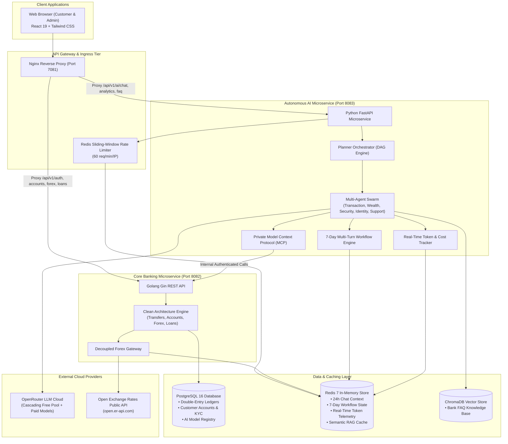
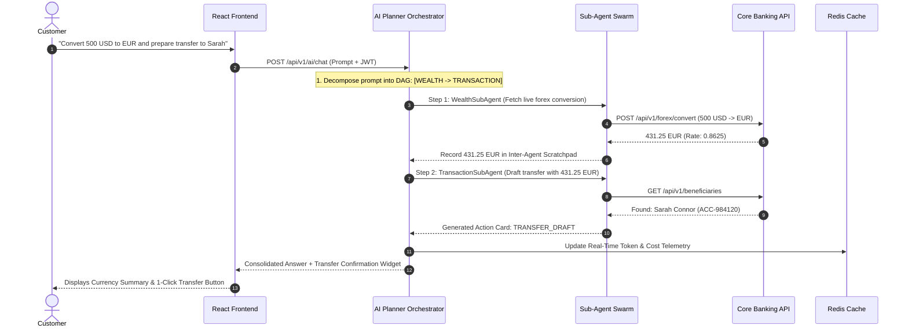
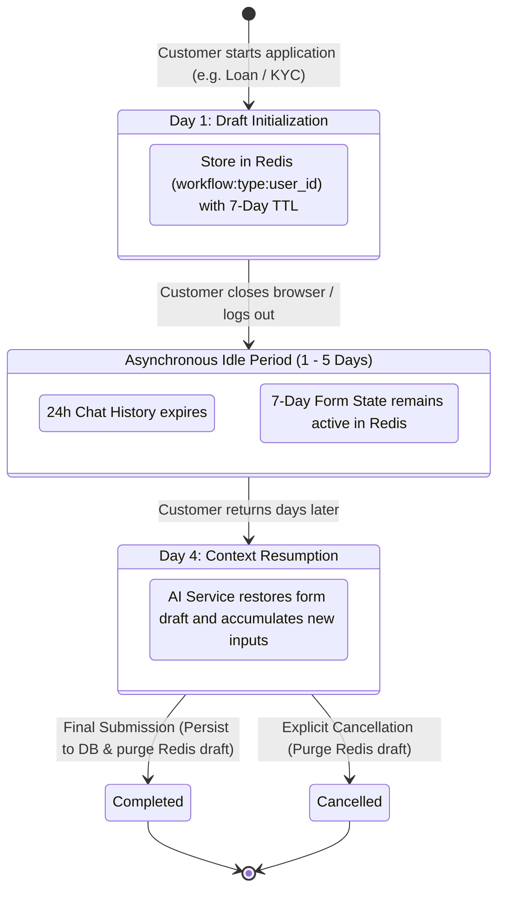
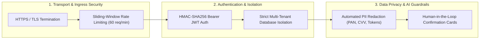

# Tirenn Autonomous Neo-Bank: High-Level System Architecture (HLD)

This document presents the **High-Level Design (HLD)** of the **Tirenn Autonomous Neo-Banking Platform**, detailing the distributed system topology, core component responsibilities, cross-service interactions, and security boundaries.

---

## 1. High-Level System Topology

Tirenn Bank operates as a modern distributed microservices ecosystem designed for high financial throughput, strict ACID data integrity, and autonomous AI-assisted banking operations.

---

## 2. Service Responsibilities & Domain Boundaries

### 2.1 Core Banking Service (`bank-core` - Golang 1.26)
* **Single Source of Truth**: Houses customer identities, accounts, cards, and the transactional ledger.
* **ACID Double-Entry Ledger**: Implements pessimistic row-level locking (`SELECT ... FOR UPDATE`) to prevent race conditions and overdrafts during peer-to-peer transfers.
* **Decoupled Forex Gateway**: Isolates external public API communication from core banking usecases, providing in-memory and Redis multi-level caching with bank spread calculation.

### 2.2 Autonomous AI Microservice (`bank-ai` - Python 3.11)
* **Planner Orchestrator (DAG Generator)**: Automatically decomposes complex multi-intent customer queries into ordered execution graphs.
* **Inter-Agent Shared Scratchpad**: Enables seamless data hand-off (e.g. converted currency amounts) between chained sub-agents in-memory.
* **7-Day Long-Running Workflow Engine**: Stores multi-day application drafts (Loans, Tier-2 KYC, Account Opening) in Redis (`workflow:<type>:<user_id>`) with an isolated 7-day TTL.
* **Real-Time Token & Cost Tracker**: Asynchronously computes token expenses against OpenRouter's live catalog with zero-cost guarantees for free models and real-time Redis telemetry.
* **ChromaDB Vector RAG**: Provides dense vector semantic search across bank policies and fee schedules with Redis answer caching.

### 2.3 Frontend Client (`bank-frontend` - React 19)
* **Customer Hub**: Balances, spending summaries, instant card freeze sliders, and financial calculators.
* **Interactive AI Action Cards**: Human-in-the-loop confirmation widgets for transfers and card lock operations.
* **Admin Telemetry Console**: Real-time token consumption KPIs, sub-agent cost distributions, and live audit stream tables.

---

## 3. High-Level Data Flows

### 3.1 Chained Multi-Agent Execution (Forex + Transfer)

---

### 3.2 7-Day Long-Running Workflow Lifecycle

---

## 4. High-Level Security Architecture

---

## 5. Verification & Testing Matrix

* **AI Evaluation Matrix (`make eval-ai`)**: **32/32 Passed (100%)** across 6 layers (Tools, Security, Vector RAG, Planner DAGs, 7-Day Workflows, and Cost Tracking).
* **Core Banking E2E Matrix (`make test-e2e`)**: **31/31 Passed (100%)** across 6 suites (Auth, ACID Ledger, Overdraft, Cards, Wealth, and Admin RBAC).
