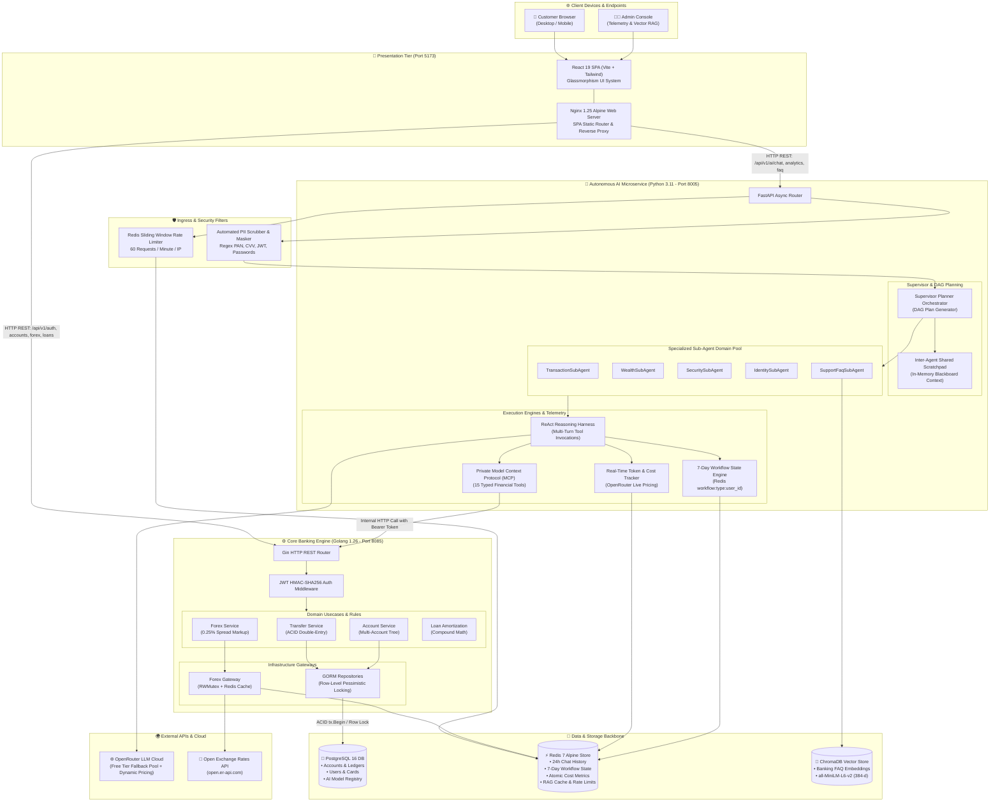
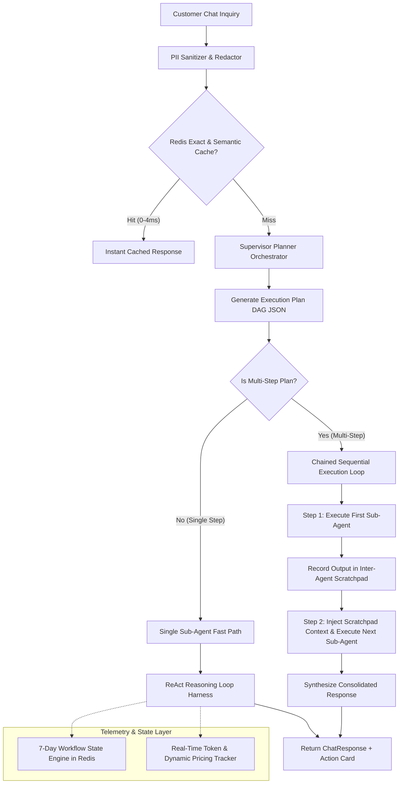
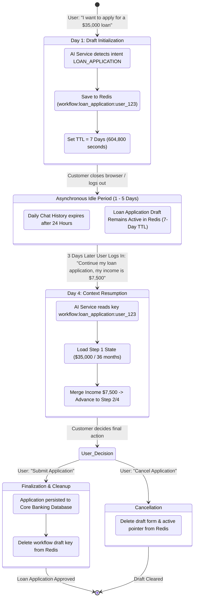
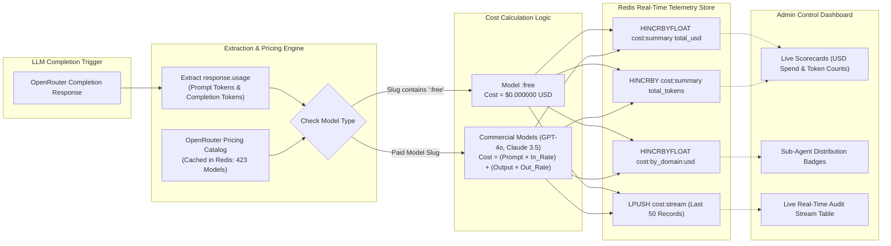
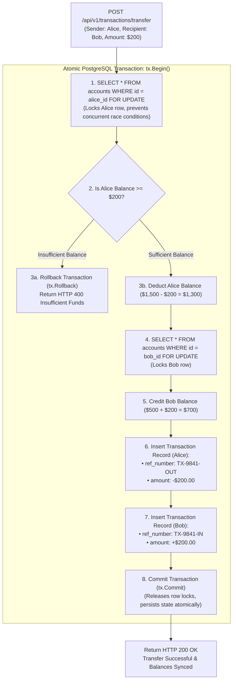

# Tirenn Autonomous Neo-Bank: System Architecture & Design Specification

This document provides a comprehensive, end-to-end architectural specification of **Tirenn Bank**, covering high-level system topology, domain boundaries, cross-cutting concerns, distributed data flows, security mechanisms, and low-level component interactions.

---

## 1. High-Level System Topology & Network Architecture

Tirenn Bank is designed as a distributed, decoupled multi-service system comprising:
1. **Core Banking Engine (`bank-core`)**: A high-performance Golang transactional ledger microservice implementing Clean/Hexagonal Architecture, ACID compliance, JWT authentication, role-based access control (RBAC), and external financial gateway integration.
2. **Autonomous AI Microservice (`bank-ai`)**: A Python FastAPI service implementing an Autonomous Planner Orchestrator, Private Model Context Protocol (MCP) server, ReAct reasoning harnesses, ChromaDB vector retrieval-augmented generation (RAG), a 7-day multi-turn workflow engine in Redis, and a dynamic LLM token/cost tracking engine.
3. **Frontend Client Application (`bank-frontend`)**: A React 19 single-page application built with Vite and Tailwind CSS, featuring glassmorphism aesthetics, interactive AI action cards, customer financial dashboards, and administrative telemetry control panels.
4. **Data & Infrastructure Backbone**:
   - **PostgreSQL 16**: Primary relational storage for accounts, ACID transactions, users, beneficiaries, and immutable AI model registries.
   - **Redis 7 (Alpine)**: Distributed high-speed cache for sliding-window rate limiting, semantic RAG query caching, 24-hour conversational history, 7-day multi-turn workflow state, and atomic token/cost telemetry counters.
   - **ChromaDB**: High-dimensional vector database for banking FAQ semantic retrieval and dynamic document embeddings.



---

## 2. Core Service Boundaries & Clean Architecture

### 2.1 Core Banking Engine (`backend/core`)
The Core Banking Engine strictly adheres to **Clean Architecture / Hexagonal Architecture** with four distinct layers:

```
┌─────────────────────────────────────────────────────────────┐
│ 1. Enterprise Domain Entities (internal/domain)            │
│    • Pure Go structs: User, Account, Transaction, Beneficiary│
│    • Domain Interfaces: UserRepository, AccountRepository,  │
│      ForexRateProvider, TransactionRepository               │
├─────────────────────────────────────────────────────────────┤
│ 2. Application Use Cases (internal/service)                 │
│    • Business Rules: TransferService, AccountService,       │
│      ForexService, LoanService, AuthService                 │
│    • Pure domain logic: zero direct network/HTTP dependencies│
├─────────────────────────────────────────────────────────────┤
│ 3. Infrastructure & Gateways (internal/gateway, repository) │
│    • GORM PostgreSQL Repositories with ACID row-locking     │
│    • ForexGateway: HTTP client, Redis cache & fallback rates│
├─────────────────────────────────────────────────────────────┤
│ 4. Delivery & Transport (internal/handler, internal/app)    │
│    • Gin REST HTTP Handlers, JWT Middleware, RequestID, CORS│
│    • Dependency Injection Container (app.go)                │
└─────────────────────────────────────────────────────────────┘
```

#### Key Design Patterns in `bank-core`:
* **Dependency Inversion Principle (DIP)**: Services depend exclusively on domain abstractions (interfaces), never on concrete repository or external HTTP implementations.
* **ACID Double-Entry Ledger**: Funds transfers execute inside atomic PostgreSQL transactions (`tx.Begin()`) utilizing row-level pessimistic locking (`SELECT ... FOR UPDATE`) to guarantee absolute consistency under concurrent load.
* **Deterministic Transaction Reference Tagging**: Transfers generate paired transaction records with `-OUT` (debit) and `-IN` (credit) suffixes to ensure unique idempotency keys.
* **Multi-Level Forex Caching**: The `ForexGateway` combines in-memory read-write mutex locks (`sync.RWMutex`, 15-minute TTL) and distributed Redis caching (`forex:rates:usd`, 1-hour TTL) before calling external APIs.

---

### 2.2 Autonomous AI Microservice (`backend/ai-service`)
The AI Service is structured around **Domain-Driven Multi-Agent Systems** and **Autonomous Graph Planning**:



---

## 3. Data Flow & Sequence Diagrams

### 3.1 Chained Multi-Agent Execution Flow (Forex + Transfer)

```mermaid
sequenceDiagram
    autonumber
    actor Customer as 👤 Customer
    participant UI as 📱 React Copilot UI
    participant Planner as 🗺️ Planner Orchestrator
    participant WLT as 💎 WealthSubAgent
    participant Scratchpad as 📋 Shared Scratchpad
    participant TX as 💳 TransactionSubAgent
    participant MCP as 🔌 Private MCP Server
    participant Core as ⚙️ Core Banking API
    participant Cost as 💰 Cost Tracker

    Customer->>UI: "Convert 500 USD to EUR then transfer to Sarah"
    UI->>Planner: POST /api/v1/ai/chat (Prompt + JWT)
    
    rect rgb(30, 41, 59)
    Note over Planner: 1. Generate Structured Execution Plan (DAG)
    Planner->>Planner: Plan: [Step 1: WEALTH (Forex), Step 2: TRANSACTION (Transfer)]
    end

    rect rgb(15, 23, 42)
    Note over WLT,Core: Step 1: Execute WealthSubAgent
    Planner->>WLT: Execute Step 1 (Objective: Convert 500 USD to EUR)
    WLT->>MCP: Call Tool: convert_currency(from: "USD", to: "EUR", amount: 500)
    MCP->>Core: POST /api/v1/forex/convert
    Core-->>MCP: 200 OK -> 431.25 EUR (Rate: 0.8625)
    MCP-->>WLT: Observation: 431.25 EUR
    WLT-->>Planner: Response: "500 USD successfully converted to 431.25 EUR"
    Planner->>Scratchpad: Store: { converted_amount: 431.25, currency: "EUR" }
    end

    rect rgb(23, 37, 84)
    Note over TX,Core: Step 2: Execute TransactionSubAgent (Using Step 1 Output)
    Planner->>TX: Execute Step 2 (Enriched with Scratchpad: 431.25 EUR)
    TX->>MCP: Call Tool: get_beneficiaries()
    MCP->>Core: GET /api/v1/beneficiaries
    Core-->>MCP: Found: Sarah Connor (Account: ACC-984120)
    TX-->>Planner: Generated Action: TRANSFER_DRAFT (431.25 EUR to ACC-984120)
    end

    Planner->>Cost: Record Usage (Tokens & Cost in USD)
    Planner-->>UI: Consolidated Reply + Interactive Confirmation Action Card
    UI-->>Customer: Displays Currency Summary & 1-Click Transfer Confirmation
```



---

## 4. Long-Running Multi-Turn Workflow State Engine (7-Day TTL)



---

## 5. Real-Time Token & Dynamic Pricing Architecture



---

## 6. Core Banking ACID Ledger & Row Locking Flow



---

## 7. Security Architecture & Boundary Isolation

1. **Defense-in-Depth Authentication**: Every core banking endpoint requires a cryptographically signed HMAC-SHA256 JWT Bearer token with expiration verification.
2. **Multi-Tenant Account Isolation**: Database queries strictly enforce `WHERE user_id = ?`. Cross-account lookups return HTTP 403 / 404.
3. **Automated PII Masking & Redaction**: Inbound prompts and outbound completions pass through regex filters in `pii_redactor.py` (PANs masked to `•••• •••• •••• 1234`, CVVs to `[CVV_REDACTED]`, JWTs to `[AUTH_TOKEN_REDACTED]`).
4. **Human-in-the-Loop Financial Guardrail**: Sub-Agents produce structured `TRANSFER_DRAFT` cards requiring explicit customer approval on the frontend before funds move.
5. **Rate Limiting**: Distributed sliding-window rate limiting in Redis restricts traffic to 60 requests per minute.

---

## 8. Automated Verification Matrix

1. **AI Evaluation Matrix (`make eval-ai`)**: 32/32 Test Cases Passed (100.0%) across 6 layers (Tools, Security, Vector RAG, Planner Orchestrator DAGs, 7-Day Workflow State, and Dynamic Cost Tracker).
2. **Core Banking E2E Matrix (`make test-e2e`)**: 31/31 Test Cases Passed (100.0%) across 6 suites (Auth, ACID Ledger, Overdraft, Cards, Wealth, and Admin RBAC).
