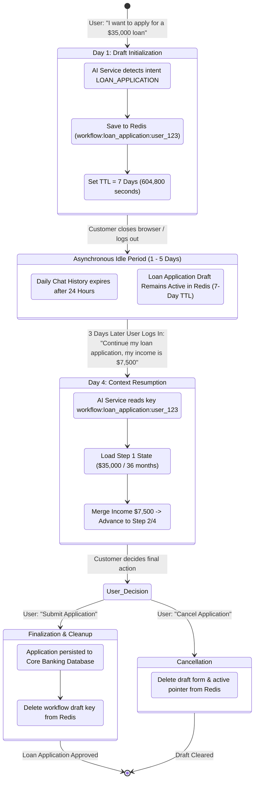
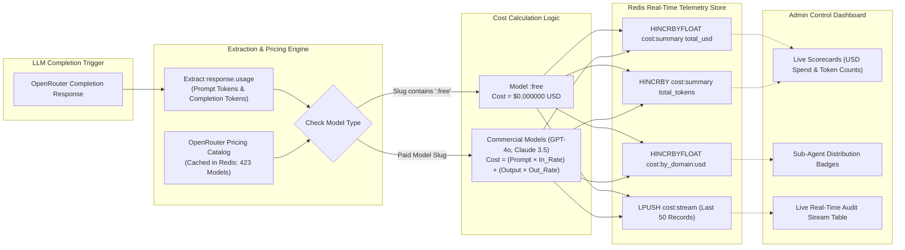

# Tirenn Autonomous AI Microservice (`bank-ai`): Service Architecture

This document details the low-level and high-level architectural design of the **Tirenn Banking AI Microservice (`bank-ai`)**, written in **Python 3.11** with **FastAPI**, **Private Model Context Protocol (MCP)**, **Autonomous Graph Planning (DAG)**, **ChromaDB Vector RAG**, **7-Day Redis Long-Running Workflow Engine**, and **Dynamic OpenRouter Token/Cost Tracking**.

---

## 1. Architectural Philosophy & Layered Topology

```
┌────────────────────────────────────────────────────────────────────────┐
│ 1. API Transport & Security Layer (app/api, app/middleware)           │
│    • FastAPI Endpoints: /chat, /session, /analytics/cost, /faq         │
│    • PII Sanitizer: Regex masking of PAN, CVV, Passwords, Tokens       │
│    • Redis Sliding Window Rate Limiter (60 req/min per IP)             │
├────────────────────────────────────────────────────────────────────────┤
│ 2. Orchestration & Planning Layer (app/services/agent_service.py)      │
│    • Supervisor Planner Orchestrator: Decomposes prompts into DAG Plans│
│    • Inter-Agent Shared Scratchpad: In-memory observation blackboard   │
│    • Fast Path vs. Multi-Step Chained Sequential Execution Loop        │
├────────────────────────────────────────────────────────────────────────┤
│ 3. Specialized Sub-Agent Domain Layer (app/services/agent_service.py)  │
│    • TransactionSubAgent: Balances, transfers, ledger lookups          │
│    • WealthSubAgent: Live forex conversions & loan amortization        │
│    • SecuritySubAgent: Card freezing & transfer limit adjustments      │
│    • IdentitySubAgent: KYC documents & address verification            │
│    • SupportFaqSubAgent: Vector FAQ semantic retrieval                 │
├────────────────────────────────────────────────────────────────────────┤
│ 4. Reasoning Harness & Telemetry (app/services)                       │
│    • ReActLoopHarness: Multi-iteration reasoning & tool execution      │
│    • ModelFallbackMechanism: Cascading failover across 7 free models   │
│    • WorkflowStateService: 7-day TTL isolated Redis workflow engine    │
│    • CostTrackerService: Real-time dynamic pricing & Redis telemetry   │
├────────────────────────────────────────────────────────────────────────┤
│ 5. Repositories & Vector Embeddings (app/repositories)                 │
│    • MCPRepository: Dispatches typed tools to Core Banking API         │
│    • FAQRepository: ChromaDB dense embeddings collection               │
└────────────────────────────────────────────────────────────────────────┘
```

---

## 2. Directory Structure & Component Roles

```
backend/ai-service/
├── app/
│   ├── api/
│   │   └── v1/
│   │       ├── chat.py             # Chat, session history, and cost analytics endpoints
│   │       ├── faq.py              # ChromaDB document upload & search endpoints
│   │       └── router.py           # V1 API router aggregator
│   ├── domain/
│   │   └── schemas.py              # Pydantic DTOs: ChatRequest, ChatResponse, WorkflowState, ExecutionPlan
│   ├── repositories/
│   │   ├── faq_repository.py       # ChromaDB vector store wrapper
│   │   └── mcp_repository.py       # Private MCP server tool registry & HTTP invoker
│   ├── services/
│   │   ├── agent_service.py        # Planner Orchestrator & Sub-Agent definitions
│   │   ├── chat_history_service.py # Redis conversational history (24h TTL)
│   │   ├── cost_tracker_service.py # Dynamic OpenRouter token pricing & cost aggregator
│   │   ├── faq_service.py          # FAQ business logic & sliding window chunker
│   │   ├── model_fallback.py       # Database-backed model cascade & paid mode validator
│   │   ├── pii_redactor.py         # Regex PII scrubber (PAN, CVV, Bearer, Keys)
│   │   ├── prompt_loader.py        # Markdown prompt file reader with caching
│   │   ├── rag_cache_service.py    # Redis exact & semantic answer cache (0-4ms)
│   │   ├── react_harness.py        # Multi-turn ReAct reasoning execution loop
│   │   └── workflow_state_service.py # 7-day multi-turn workflow state in Redis
│   ├── config.py                   # Pydantic Settings from environment
│   ├── logger.py                   # Structured JSON logger with ReAct trace formatting
│   ├── main.py                     # FastAPI application bootstrap & lifespan hooks
│   └── middleware.py               # RequestID and Redis sliding window rate limiter
├── prompts/                        # Specialized Sub-Agent markdown system prompts
│   ├── identity_agent.md
│   ├── security_agent.md
│   ├── supervisor_router.md
│   ├── support_faq_agent.md
│   ├── transaction_agent.md
│   └── wealth_agent.md
├── tests/
│   └── evals/                      # 6-Layer AI Evaluation Harness
│       ├── runner.py               # Test runner & scorecard generator
│       ├── test_cost_tracker.py    # Layer 6: Dynamic token cost tests
│       ├── test_rag_quality.py     # Layer 3: ChromaDB semantic quality tests
│       ├── test_security_privacy.py# Layer 2: PII masking & tenant isolation tests
│       ├── test_sequential_orchestrator.py # Layer 4: DAG execution plan tests
│       ├── test_tool_calling.py    # Layer 1: MCP schema & calculator tests
│       └── test_workflow_state.py  # Layer 5: 7-day Redis workflow state tests
└── Dockerfile                      # Production slim image with pre-warmed embeddings
```

---

## 3. Chained Multi-Agent Sequential Hand-off & DAG Execution

The Supervisor analyzes inbound prompts and produces an ordered execution plan (DAG):

```mermaid
sequenceDiagram
    autonumber
    actor Customer as 👤 Customer
    participant UI as 📱 React Copilot UI
    participant Planner as 🗺️ Planner Orchestrator
    participant WLT as 💎 WealthSubAgent
    participant Scratchpad as 📋 Shared Scratchpad
    participant TX as 💳 TransactionSubAgent
    participant MCP as 🔌 Private MCP Server
    participant Core as ⚙️ Core Banking API
    participant Cost as 💰 Cost Tracker

    Customer->>UI: "Convert 500 USD to EUR then transfer to Sarah"
    UI->>Planner: POST /api/v1/ai/chat (Prompt + JWT)
    
    rect rgb(30, 41, 59)
    Note over Planner: 1. Generate Structured Execution Plan (DAG)
    Planner->>Planner: Plan: [Step 1: WEALTH (Forex), Step 2: TRANSACTION (Transfer)]
    end

    rect rgb(15, 23, 42)
    Note over WLT,Core: Step 1: Execute WealthSubAgent
    Planner->>WLT: Execute Step 1 (Objective: Convert 500 USD to EUR)
    WLT->>MCP: Call Tool: convert_currency(from: "USD", to: "EUR", amount: 500)
    MCP->>Core: POST /api/v1/forex/convert
    Core-->>MCP: 200 OK -> 431.25 EUR (Rate: 0.8625)
    MCP-->>WLT: Observation: 431.25 EUR
    WLT-->>Planner: Response: "500 USD successfully converted to 431.25 EUR"
    Planner->>Scratchpad: Store: { converted_amount: 431.25, currency: "EUR" }
    end

    rect rgb(23, 37, 84)
    Note over TX,Core: Step 2: Execute TransactionSubAgent (Using Step 1 Output)
    Planner->>TX: Execute Step 2 (Enriched with Scratchpad: 431.25 EUR)
    TX->>MCP: Call Tool: get_beneficiaries()
    MCP->>Core: GET /api/v1/beneficiaries
    Core-->>MCP: Found: Sarah Connor (Account: ACC-984120)
    TX-->>Planner: Generated Action: TRANSFER_DRAFT (431.25 EUR to ACC-984120)
    end

    Planner->>Cost: Record Usage (Tokens & Cost in USD)
    Planner-->>UI: Consolidated Reply + Interactive Confirmation Action Card
    UI-->>Customer: Displays Currency Summary & 1-Click Transfer Confirmation
```



---

## 4. 7-Day Long-Running Multi-Turn Workflow State Engine



---

## 5. Real-Time Token & Dynamic Pricing Architecture



---

## 6. ChromaDB Vector RAG Engine
* **Embedding Model**: `all-MiniLM-L6-v2` dense vector embeddings (384 dimensions).
* **Sliding Window Chunking**: Splits uploaded policy manuals into 500-character segments with 100-character overlap.
* **Semantic Retrieval**: Cosine distance threshold with top-3 match aggregation and Redis exact/semantic caching (0-4 ms response).
