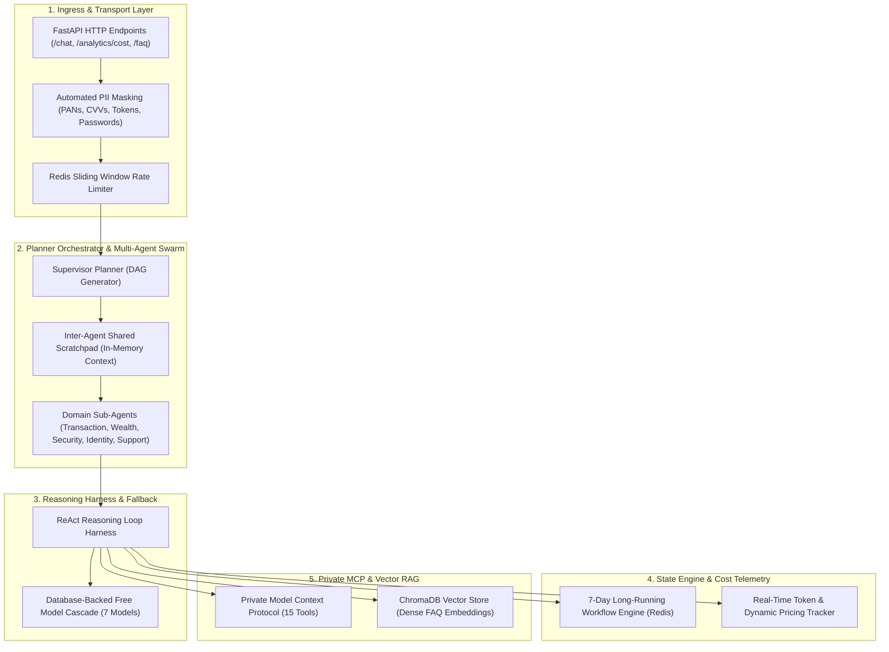

# Tirenn Autonomous AI Microservice (`bank-ai`): High-Level Architecture (HLD)

This document provides the **High-Level Design (HLD)** of the **Tirenn Autonomous AI Microservice (`bank-ai`)**, built with **Python 3.11**, **FastAPI**, **Multi-Agent Planner Orchestration**, and **ChromaDB Vector RAG**.

---

## 1. High-Level Architectural Layers

---

## 2. Core Architectural Capabilities

### 2.1 Autonomous Planner Orchestrator (DAG Execution)
* **Single-Intent Fast Path**: Direct single-turn execution for simple balance or FAQ inquiries with 0 ms multi-agent overhead.
* **Multi-Intent Chaining**: Decomposes complex commands into a sequence of sub-agent executions, transferring intermediate observations (amounts, currencies, account IDs) through the in-memory scratchpad.

### 2.2 7-Day Long-Running Multi-Turn Workflow State Engine
* Persists incomplete multi-day application drafts (Loans, Tier-2 KYC, Account Opening) in Redis keys (`workflow:<type>:<user_id>`) with an isolated 7-day TTL (604,800s).
* Leaves the 24-hour conversational chat history unpolluted, keeping token windows lean.

### 2.3 Real-Time Token & Dynamic Pricing Tracker
* Automatically extracts `response.usage` across all LLM completions.
* Calculates exact USD expenses against OpenRouter's live catalog, ensuring `$0.000000` for free-tier models.
* Aggregates live scorecards, domain distributions, and a 50-entry audit stream in Redis.

### 2.4 ChromaDB Vector RAG Engine
* Dense embeddings (`all-MiniLM-L6-v2`) with sliding-window chunking (500 chars / 100 overlap).
* Redis exact & semantic caching providing 0-4 ms response times for common banking queries.
