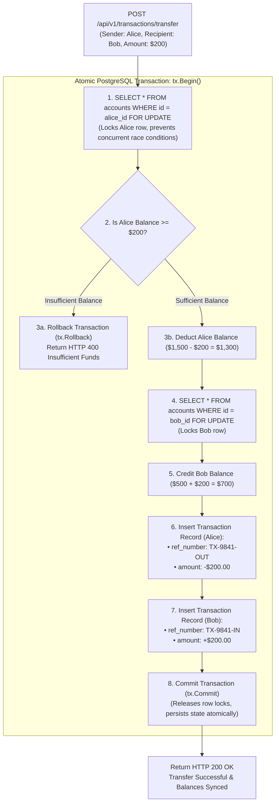

# Tirenn Core Banking Engine (`bank-core`): Service Architecture

This document details the low-level and high-level architectural design of the **Tirenn Core Banking Engine (`bank-core`)**, written in **Golang 1.26** and built on **Clean Architecture / Hexagonal Architecture principles**.

---

## 1. Architectural Philosophy & Layered Hierarchy

`bank-core` strictly segregates business logic from transport, persistence, and external network concerns through explicit domain abstractions.

```
┌────────────────────────────────────────────────────────────────────────┐
│ 1. Delivery Layer (internal/handler)                                   │
│    • Gin Web Engine HTTP Controllers                                   │
│    • DTO Binding, Parameter Parsing, HTTP Status Codes (200, 201, 400) │
│    • Custom Middleware: JWT Auth, RequestID Tracing, CORS, Rate Limit   │
├────────────────────────────────────────────────────────────────────────┤
│ 2. Usecase / Service Layer (internal/service)                          │
│    • Pure Financial Domain Rules: TransferService, AccountService,     │
│      ForexService, LoanService, AuthService, BeneficiaryService        │
│    • ZERO direct database drivers or external network calls            │
├────────────────────────────────────────────────────────────────────────┤
│ 3. Domain Entity & Port Layer (internal/domain)                        │
│    • Domain Models: User, Account, Transaction, Beneficiary, AIModel   │
│    • Interface Contracts: UserRepository, AccountRepository,           │
│      TransactionRepository, BeneficiaryRepository, ForexRateProvider   │
├────────────────────────────────────────────────────────────────────────┤
│ 4. Infrastructure & Gateway Layer (internal/gateway, repository)       │
│    • GORM PostgreSQL Repositories with ACID row-locking transactions   │
│    • ForexGateway: HTTP Client, Redis Caching (1hr), In-Memory Mutex   │
│    • Goose Database Migrations                                         │
└────────────────────────────────────────────────────────────────────────┘
```

---

## 2. Directory Structure & Component Roles

```
backend/core/
├── cmd/
│   └── api/
│       └── main.go                 # Application bootstrap entrypoint
├── internal/
│   ├── app/
│   │   └── app.go                  # Dependency Injection container & router wiring
│   ├── config/
│   │   └── config.go               # Viper / Environment variable loader
│   ├── domain/
│   │   ├── account.go              # Account entities & DTOs
│   │   ├── auth.go                 # Authentication DTOs
│   │   ├── beneficiary.go          # Beneficiary entities & DTOs
│   │   ├── forex.go                # Currency conversion requests & responses
│   │   ├── interfaces.go           # Abstract Port Interfaces (Repositories & Gateways)
│   │   ├── loan.go                 # Loan amortization structs
│   │   ├── models.go               # AI Model registry entities
│   │   ├── transaction.go          # Double-entry transaction ledger entities
│   │   └── user.go                 # Customer profile & identity entities
│   ├── gateway/
│   │   └── forex_gateway.go        # Infrastructure gateway for open.er-api.com & Redis
│   ├── handler/
│   │   ├── account_handler.go      # Account lookup, creation, statement endpoints
│   │   ├── auth_handler.go         # Login, register, profile, address updates
│   │   ├── beneficiary_handler.go  # Payee directory management endpoints
│   │   ├── forex_handler.go        # Live currency conversion endpoints
│   │   ├── loan_handler.go         # Loan amortization simulation endpoints
│   │   ├── models_handler.go       # Admin AI model fallback registry endpoints
│   │   └── transaction_handler.go  # P2P Transfer & spending summary endpoints
│   ├── middleware/
│   │   ├── auth_middleware.go      # JWT Bearer verification & context injection
│   │   ├── cors_middleware.go      # CORS security headers
│   │   └── request_id.go           # X-Request-ID correlation tracing
│   ├── repository/
│   │   ├── account_repository.go   # PostgreSQL account CRUD & balance lookups
│   │   ├── beneficiary_repository.go
│   │   ├── models_repository.go    # System AI model list (priority-ordered)
│   │   ├── transaction_repository.go # Atomic transfer ledger transactions
│   │   └── user_repository.go      # User identity & password hashing
│   └── service/
│       ├── account_service.go      # Account provisioning & multi-account hierarchy
│       ├── auth_service.go         # Password verification & JWT minting
│       ├── beneficiary_service.go  # Payee whitelist validations
│       ├── forex_service.go        # Pure usecase: spread calculation (0.25%)
│       ├── loan_service.go         # Compound interest amortization formulas
│       ├── models_service.go       # Free model priority queue retrieval
│       └── transfer_service.go     # Transfer orchestration & overdraft guardrails
├── migrations/                     # Goose SQL migration scripts
├── Dockerfile                      # Multi-stage production build (Alpine)
├── Makefile                        # Automation targets
└── go.mod                          # Dependencies & Go toolchain
```

---

## 3. Detailed Low-Level Component Implementations

### 3.1 ACID Double-Entry Transaction Ledger & Row Locking Flow

Financial integrity is enforced via atomic database transactions with row-level pessimistic locking:



---

### 3.2 Decoupled Forex Gateway Pattern

```mermaid
flowchart TD
    Req["POST /api/v1/forex/convert<br/>(from: USD, to: EUR, amount: 1000)"] --> Handler[ForexHandler]
    Handler --> Service["ForexService (Usecase Layer)<br/>• Validates currency pair<br/>• Injects 0.25% spread fee<br/>• Computes converted total"]
    
    Service -->|Calls domain.ForexRateProvider Port| Gateway["ForexGateway (Infra Layer)"]
    
    Gateway --> CheckMem{Check In-Memory Cache?<br/>sync.RWMutex (15 min TTL)}
    CheckMem -- Hit --> ReturnRates[Return Rate Map]
    
    CheckMem -- Miss --> CheckRedis{Check Redis Cache?<br/>Key: forex:rates:usd (1 hr TTL)}
    CheckRedis -- Hit --> ReturnRates
    
    CheckRedis -- Miss --> CallAPI["HTTP GET https://open.er-api.com/v6/latest/USD"]
    CallAPI --> SaveRedis[Save to Redis & In-Memory]
    SaveRedis --> ReturnRates
    
    ReturnRates --> Service
    Service --> Handler
    Handler --> Resp["Return HTTP 200 OK<br/>• Converted: 860.34 EUR<br/>• Rate: 0.8625<br/>• Spread: 2.16 EUR (0.25%)"]
```

---

### 3.3 Compound Loan Amortization Formula
The `LoanService` implements exact monthly installment computations:

$$M = P \times \frac{r(1+r)^n}{(1+r)^n - 1}$$

Where:
- $M$ = Monthly payment installment
- $P$ = Principal loan amount
- $r$ = Monthly interest rate ($\text{Annual Rate} / 12 / 100$)
- $n$ = Number of monthly installments ($\text{Term Months}$)

---

## 4. Security & Cryptographic Mechanisms

1. **Password Hashing**: Passwords are encrypted using **bcrypt** with a cost factor of 12.
2. **JWT Session Tokens**: Signed with HMAC-SHA256 containing `user_id`, `email`, `role`, and expiration timestamp.
3. **Role-Based Access Control (RBAC)**:
   - `ROLE_CUSTOMER`: Access limited to personal accounts, cards, and beneficiaries.
   - `ROLE_ADMIN`: Access to system model catalogs and administrative telemetry.
4. **Immutable Free Model Registry**: `POST`, `PUT`, `DELETE` operations on default free AI models are rejected with HTTP 404 to guarantee system resilience.
