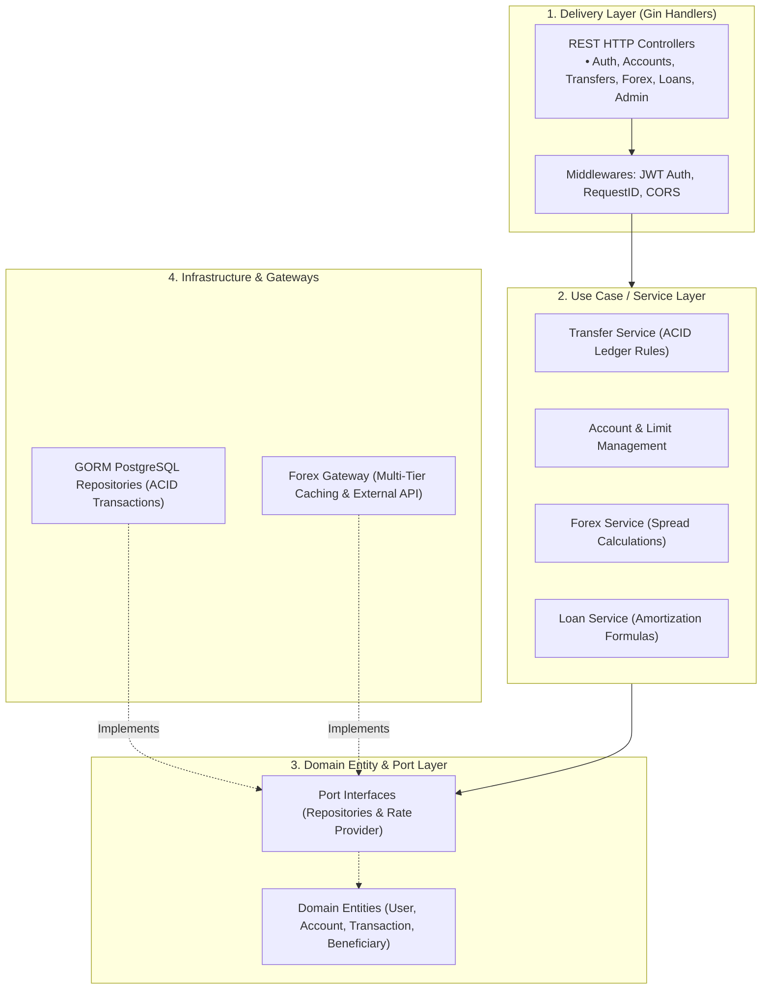
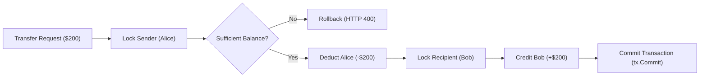

# Tirenn Core Banking Engine (`bank-core`): High-Level Architecture (HLD)

This document provides the **High-Level Design (HLD)** of the **Tirenn Core Banking Engine (`bank-core`)**, written in **Golang 1.26** following Clean Architecture principles.

---

## 1. Clean Architecture Layers

`bank-core` enforces strict decoupling of business rules from transport and infrastructure:

---

## 2. Core Subsystems

### 2.1 ACID Double-Entry Transaction Ledger
* **Atomic Fund Transfers**: Uses database transactions (`tx.Begin()`) with row-level pessimistic locking (`SELECT ... FOR UPDATE`) to prevent race conditions and overdrafts.
* **Paired Idempotency References**: Generates debit (`-OUT`) and credit (`-IN`) records per transfer to guarantee unique auditability.

### 2.2 Decoupled Forex Gateway
* Isolates the usecase from external network HTTP calls.
* Combines **In-Memory Cache** (`sync.RWMutex`, 15-minute TTL) and **Redis Cache** (`forex:rates:usd`, 1-hour TTL) with automated fallback.

### 2.3 Financial Calculators & Security
* **Compound Loan Amortization**: Simulates monthly payments for Mortgages, Auto, and Personal loans.
* **Role-Based Access Control**: HMAC-SHA256 JWT tokens with role separation (`ROLE_CUSTOMER` and `ROLE_ADMIN`).
