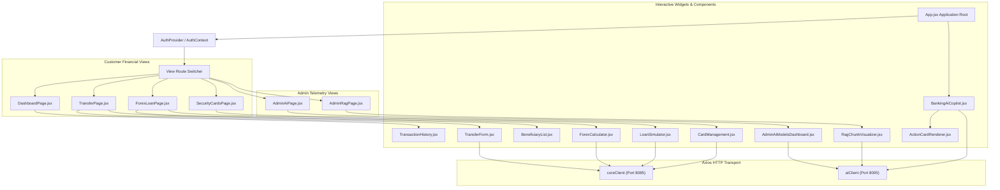

# Tirenn Frontend Client (`bank-frontend`): Architecture & Design System

This document details the architecture, state management, design tokens, and component hierarchy of the **Tirenn Banking Frontend (`bank-frontend`)**, built on **React 19**, **Vite**, and **Tailwind CSS**.

---

## 1. Architectural Topology & Component Hierarchy



---

## 2. Directory Structure

```
frontend/
├── src/
│   ├── components/
│   │   ├── AdminAiModelsDashboard.jsx # AI token cost tracker & model registry
│   │   ├── BankingAiCopilot.jsx       # AI Assistant chat interface
│   │   ├── BeneficiaryList.jsx        # Saved transfer payees manager
│   │   ├── CardManagement.jsx         # Card freeze toggle & limit adjusters
│   │   ├── ForexCalculator.jsx        # Live currency converter
│   │   ├── LoanSimulator.jsx          # Loan monthly payment calculator
│   │   ├── RagChunkVisualizer.jsx     # ChromaDB vector chunk browser
│   │   ├── TransactionHistory.jsx     # Paginated ledger transaction stream
│   │   └── TransferForm.jsx           # Manual P2P transfer interface
│   ├── context/
│   │   └── AuthContext.jsx            # User authentication state provider
│   ├── pages/
│   │   ├── AdminAiPage.jsx            # Administrative AI control portal
│   │   ├── AdminRagPage.jsx           # Knowledge base management portal
│   │   ├── DashboardPage.jsx          # Customer financial hub
│   │   ├── ForexLoanPage.jsx          # Wealth & calculator portal
│   │   ├── LoginPage.jsx              # Customer login interface
│   │   ├── RegisterPage.jsx           # Customer registration & onboarding
│   │   ├── SecurityCardsPage.jsx      # Security & card control portal
│   │   └── TransferPage.jsx           # Fund transfer portal
│   ├── services/
│   │   └── api.js                     # Unified Axios clients & API methods
│   ├── App.jsx                        # Main route dispatcher
│   ├── index.css                      # Tailwind design tokens & custom utilities
│   └── main.jsx                       # React DOM entrypoint
├── Dockerfile                         # Production multi-stage Nginx container
├── nginx.conf                         # Reverse proxy configuration
└── vite.config.js                     # Vite build & plugin settings
```

---

## 3. Glassmorphism Design System & UX Standards

The interface implements a modern, dark-mode **Glassmorphism Aesthetic**:
* **Background Palette**: Deep charcoal and navy canvas (`#0b0f19` / `#0e1726`).
* **Glass Surfaces**: `backdrop-blur-xl bg-white/[0.03] border border-white/[0.08]` providing visual hierarchy without heavy flat panels.
* **Accent Colors**:
  - Emerald (`#10b981`): Safe states, active cards, confirmed transactions, positive cash flow.
  - Amber / Orange (`#f59e0b`): Real-time token expenses, warning states, pending draft actions.
  - Sky Blue (`#0ea5e9`): Informational data, token counts, currency rates.
  - Rose (`#f43f5e`): Frozen cards, destructive actions, overdraft errors.

---

## 4. Interactive AI Action Cards & Human-in-the-Loop Workflow

```mermaid
sequenceDiagram
    autonumber
    actor Customer as 👤 Customer
    participant Copilot as 🤖 BankingAiCopilot
    participant CoreAPI as ⚙️ Core Banking API (Port 8085)
    participant Ledger as 💾 PostgreSQL Ledger

    Customer->>Copilot: "Transfer $200 to Bob"
    Copilot-->>Customer: Renders Interactive Action Card (TRANSFER_DRAFT)
    
    rect rgb(30, 41, 59)
    Note over Customer,Copilot: Human-in-the-Loop Security Guardrail
    Customer->>Copilot: Clicks "Confirm & Execute Transfer"
    Copilot->>CoreAPI: POST /api/v1/transactions/transfer (Bearer Token)
    CoreAPI->>Ledger: Atomic ACID Transaction (Pessimistic Row Lock)
    Ledger-->>CoreAPI: Success
    CoreAPI-->>Copilot: 200 OK (Transfer Confirmed)
    end

    Copilot-->>Customer: Green Success Card + Updated Balance
```


