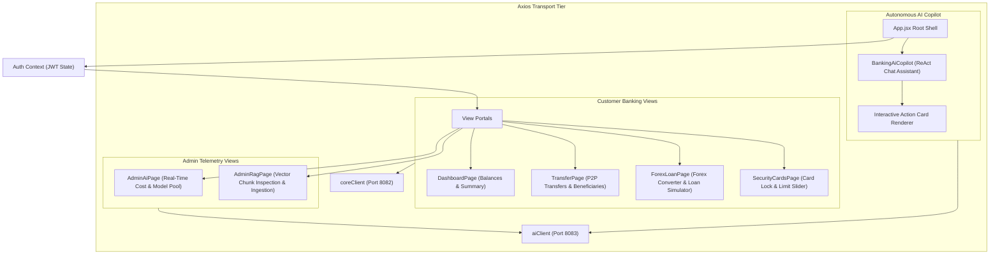

# Tirenn Frontend Client (`bank-frontend`): High-Level Architecture (HLD)

This document provides the **High-Level Design (HLD)** of the **Tirenn Banking Frontend (`bank-frontend`)**, built with **React 19**, **Vite**, and **Tailwind CSS**.

---

## 1. High-Level Component Topology

---

## 2. Core Frontend Principles

1. **Dark-Mode Glassmorphism Aesthetic**: Deep navy and charcoal surfaces with `backdrop-blur-xl`, subtle borders (`border-white/[0.08]`), and status-aware color tokens (Emerald, Amber, Sky Blue, Rose).
2. **Interactive AI Action Cards (Human-in-the-Loop)**: Sub-agents generate interactive confirmation widgets for critical actions (`TRANSFER_DRAFT`, `CARD_FROZEN`). Users must explicitly click "Confirm" to trigger the transaction.
3. **Session-Safe API Key Storage**: Custom OpenRouter API keys and model overrides are strictly stored in `sessionStorage`, preventing persistent token leaks to local disk.
